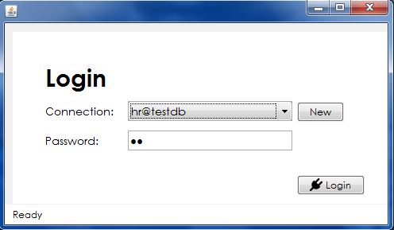
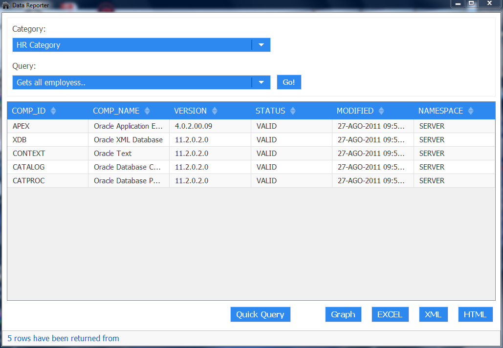

# data-reporter
Swing Java 1.7 tool which let you extract data from a database in different formats  
It is written using a kind of MVC pattern in order to separate the Presentation from the Controllers and the Domain.  

### Features
You can pre configure trees of queries or create new ones  
Export is possible in html, csv, excel, xml  
You simply can save your connections in a local database  
The JTable fetch subset of data any time you scroll the bar to avoid memory problems  

### External dependencies
Spring 3, Lombok, JUnit, Apache Derby, Apache POI, JFree Chart, Slf4j, thesefoolishthings (see Fabrizio Giudici)

#### Login form example

  

#### Main form example

  

